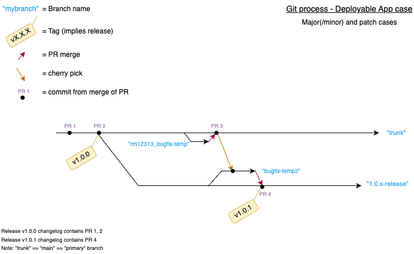

# Release

This file describes the process for publishing a new version of the app as a GitHub release.

Releases are managed through the [GitHub Releases](https://github.com/health-connector/enroll/releases) page.

Release names follow the [Semantic Versioning](https://semver.org/) standard.

Follow the steps below to package and release a new version.

## Major/Minor release
### Publishing the Release
1. Checkout the master branch and pull the latest changes.
2. Create and checkout a new release branch, in the pattern of `1.0.x-release`.
    - Note: `x` is literal, to aid reuse of same branch for minor bugfixes.
3. `git push` the new branch.
4. Create a new annotated tag with the version number, e.g., `git tag -as v1.0.0 -m "v1.0.0"`.
    - IMPORTANT: make sure the tag abides by the format `vX.Y.Z` where `X`, `Y`, and `Z` are integers. It is important that the tag name has a different format than any branch name to avoid confusion with Bundler.
5. Push the tag to the remote repository, e.g., `git push origin refs/tags/v1.0.0`.
    - Avoid `git push --tags`, to not accidentally push random assorted local tags.
6. GitHub Actions will automatically create a new release on the [GitHub Releases](https://github.com/health-connector/enroll/releases) page with release notes. Confirm that the release was successfully published there and that all intended commits are included in the release.

## Patch/Bugfix release
### Prepare the release
1. Fix bug in the master branch, via normal PR process.

For any release that has the bug:
2. Create a temp branch off any live release branch that has the bug.
    - Using a branch, which is then PR’d, ensures traceability and inclusion of an item in the generated release notes.
3. Cherry-pick the fix commits to the temp branch.
4. `git push` the temp branch.
5. Issue a PR to merge to the release branch.

### Publishing the Release
1. Once the pull request is approved and merged, checkout the release branch and pull the latest changes.
2. Create a new annotated tag with the version number, at the point of the release branch with the fix, e.g., `git tag -as v1.0.1 -m "v1.0.1"`.
3. Push the tag to the remote repository, e.g., `git push origin refs/tags/v1.0.1`.
    - Again, better to avoid `git push --tags`.
4. Github Actions will create the release and pull in the fix PR's to the changelog.

## Git Process diagram
